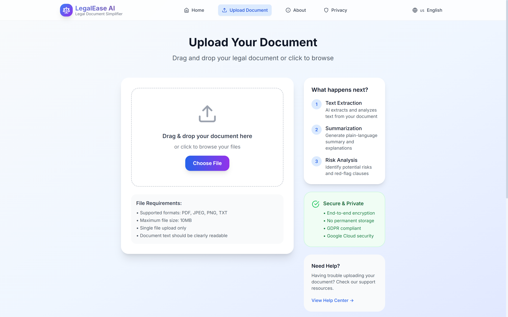
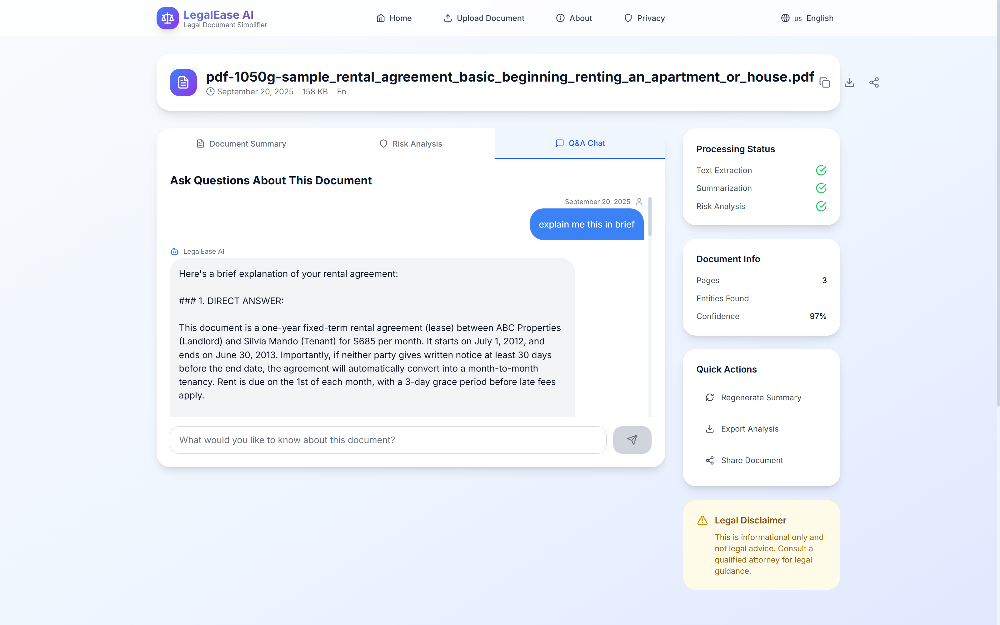

# LegalEase AI 🏛️⚖️

<div align="center">


**Simplify Legal Documents with AI**

*Making legal documents accessible to everyone through the power of artificial intelligence*

[](https://choosealicense.com/licenses/mit/)
[](https://nodejs.org/)
[](https://reactjs.org/)
[](https://cloud.google.com/)

[🚀 Live Demo](#-demo-screenshots) • [📖 Documentation](#-setup-and-installation) • [🏗️ Architecture](#-architecture) • [🤝 Contributing](#-contributing)

</div>

---

## 🌟 Overview

LegalEase AI is a comprehensive web application that leverages Google Cloud's cutting-edge Generative AI stack to democratize legal document understanding. Upload contracts, agreements, and legal documents to receive plain-language summaries, comprehensive risk analysis, and get instant answers to your questions.

### ✨ Why LegalEase AI?

- 📚 **Complex Legal Language** → Simple, understandable explanations
- ⚠️ **Hidden Risks** → Clear risk identification and warnings
- ❓ **Unanswered Questions** → Instant, AI-powered responses
- 🌐 **Language Barriers** → Bilingual support (English & Hindi)
- 🔒 **Privacy Concerns** → Secure, temporary processing with auto-deletion

---

## 🎯 Key Features

### 🚀 Core Functionality

| Feature | Description | Technology |
|---------|-------------|------------|
| **📄 Document Upload** | Support for PDF, images (JPEG, PNG), and text files | Google Cloud Storage |
| **🔍 Text Extraction** | Advanced OCR with 95%+ accuracy | Google Cloud Document AI |
| **🤖 AI Summarization** | Plain-language summaries in structured format | Vertex AI Gemini Pro |
| **⚠️ Risk Analysis** | Identify red-flag clauses and potential legal risks | Custom AI prompts + Gemini |
| **💬 Interactive Q&A** | Ask questions and get instant, grounded answers | RAG + Vertex AI |
| **🌐 Bilingual Support** | Full functionality in English and Hindi | Multi-language AI models |

### 🛡️ Security & Privacy Features

- 🔐 **End-to-End Encryption** with TLS 1.3
- 🗑️ **Automatic Data Deletion** within 24 hours
- 🚫 **No Permanent Storage** of sensitive documents
- 🛡️ **Rate Limiting** and abuse prevention
- ✅ **GDPR & CCPA Compliant**

---

## 📱 Demo Screenshots

### 1. Landing Page & Document Upload

*Clean, professional interface with drag-and-drop document upload functionality*

### 2. Document Processing

*Real-time processing status with progress indicators and estimated completion time*

### 3. Document Summary

*Structured, color-coded summary with key information clearly organized*

### 4. Risk Analysis

*Comprehensive risk assessment with severity levels and actionable insights*

### 5. Interactive Q&A Chat

*Intelligent question-answering system with contextual responses*

---

## 🏗️ System Architecture

### High-Level Architecture Diagram


### Detailed Component Architecture


---

## 📊 Application State Flow

### Document Processing State Diagram


### User Interaction Flow


---

## 🛠️ Technology Stack

### Frontend Stack
```
React 18.2.0
├── TailwindCSS 3.3.0          # Utility-first CSS framework
├── Framer Motion 10.16.4      # Animation library
├── React Router 6.15.0        # Client-side routing
├── Axios 1.5.0                # HTTP client
├── Lucide React 0.279.0       # Icon library
└── React Hook Form 7.45.4     # Form handling
```

### Backend Stack
```
Node.js 18+ & Express.js 4.18.2
├── Multer 1.4.5               # File upload handling
├── Helmet 7.0.0               # Security middleware
├── Winston 3.10.0             # Logging framework
├── Express Rate Limit 6.10.0  # Rate limiting
├── CORS 2.8.5                 # Cross-origin requests
└── Joi 17.9.2                 # Input validation
```

### Google Cloud Services
```
Google Cloud Platform
├── Document AI                # OCR & text extraction
├── Vertex AI (Gemini Pro)     # Language model
├── Cloud Storage              # File storage
├── Firestore                  # NoSQL database
├── Cloud Monitoring           # Observability
└── Cloud IAM                  # Access management
```

---

## 🚀 Quick Start Guide

### Prerequisites Checklist

- [ ] **Node.js 18+** and npm installed
- [ ] **Google Cloud Project** with billing enabled
- [ ] **Google Cloud CLI** installed and configured
- [ ] **Service Account** with appropriate permissions

### 1️⃣ Google Cloud Setup

```bash
# Create a new Google Cloud project
gcloud projects create legalease-ai-$(date +%s) --name="LegalEase AI"
export PROJECT_ID=$(gcloud config get-value project)

# Enable required APIs
gcloud services enable documentai.googleapis.com \
                       aiplatform.googleapis.com \
                       storage.googleapis.com \
                       firestore.googleapis.com

# Create service account
gcloud iam service-accounts create legalease-ai \
  --description="LegalEase AI Service Account" \
  --display-name="LegalEase AI"

# Grant necessary permissions
for role in roles/documentai.apiUser \
           roles/aiplatform.user \
           roles/storage.admin \
           roles/datastore.user; do
  gcloud projects add-iam-policy-binding $PROJECT_ID \
    --member="serviceAccount:legalease-ai@$PROJECT_ID.iam.gserviceaccount.com" \
    --role="$role"
done

# Create and download service account key
gcloud iam service-accounts keys create service-account-key.json \
  --iam-account=legalease-ai@$PROJECT_ID.iam.gserviceaccount.com
```

### 2️⃣ Local Development Setup

```bash
# Clone the repository
git clone https://github.com/your-username/legalease-ai.git
cd legalease-ai

# Install all dependencies
npm run install-all

# Set up environment variables
cp server/.env.example server/.env
# Edit server/.env with your configuration

# Place service account key
mv service-account-key.json server/

# Start development servers
npm run dev
```

### 3️⃣ Environment Configuration

Create `server/.env` file:

```env
# Server Configuration
PORT=5000
NODE_ENV=development
CLIENT_URL=http://localhost:3000

# Google Cloud Configuration
GOOGLE_CLOUD_PROJECT_ID=your-project-id
GOOGLE_APPLICATION_CREDENTIALS=./service-account-key.json

# Google Cloud Storage
GCS_BUCKET_NAME=legalease-documents-bucket
GCS_REGION=us-central1

# Document AI
DOCUMENT_AI_PROCESSOR_ID=your-processor-id
DOCUMENT_AI_LOCATION=us

# Vertex AI
VERTEX_AI_LOCATION=us-central1
VERTEX_AI_MODEL=gemini-1.5-pro

# Security
JWT_SECRET=your-super-secret-jwt-key-min-32-chars
ENCRYPTION_KEY=your-32-character-encryption-key-here

# Rate Limiting
RATE_LIMIT_WINDOW_MS=900000
RATE_LIMIT_MAX_REQUESTS=100
```

---

## 🚀 Deployment Options

### 📦 Google Cloud Run (Recommended)

```bash
# Build and deploy to Cloud Run
gcloud run deploy legalease-ai \
  --source . \
  --platform managed \
  --region us-central1 \
  --allow-unauthenticated \
  --memory 2Gi \
  --cpu 2 \
  --max-instances 100 \
  --set-env-vars NODE_ENV=production,GOOGLE_CLOUD_PROJECT_ID=$PROJECT_ID
```

### 🐳 Docker Deployment

```dockerfile
# Dockerfile
FROM node:18-alpine

WORKDIR /app
COPY package*.json ./
RUN npm ci --only=production

COPY . .
RUN cd client && npm ci && npm run build

EXPOSE 5000
CMD ["npm", "start"]
```

```bash
# Build and run with Docker
docker build -t legalease-ai .
docker run -p 5000:5000 --env-file server/.env legalease-ai
```

### ☁️ Other Deployment Platforms

| Platform | Complexity | Cost | Scalability | Documentation |
|----------|------------|------|-------------|---------------|
| **Google Cloud Run** | ⭐⭐ | $ | ⭐⭐⭐⭐⭐ | [Guide](docs/deploy-cloudrun.md) |
| **Google App Engine** | ⭐⭐⭐ | $$ | ⭐⭐⭐⭐ | [Guide](docs/deploy-appengine.md) |
| **AWS Elastic Beanstalk** | ⭐⭐⭐ | $$ | ⭐⭐⭐⭐ | [Guide](docs/deploy-aws.md) |
| **Heroku** | ⭐ | $$$ | ⭐⭐⭐ | [Guide](docs/deploy-heroku.md) |
| **DigitalOcean App Platform** | ⭐⭐ | $ | ⭐⭐⭐ | [Guide](docs/deploy-digitalocean.md) |

---

## 🔧 API Reference

### 📄 Document Management

#### Upload Document
```http
POST /api/documents/upload
Content-Type: multipart/form-data

Body:
- document: File (PDF, JPEG, PNG, TXT)
- language: "en" | "hi"
- options: JSON string (optional)

Response:
{
  "success": true,
  "documentId": "doc_abc123",
  "data": {
    "summary": { ... },
    "riskAnalysis": { ... },
    "extractedData": { ... }
  }
}
```

#### Get Document
```http
GET /api/documents/:documentId

Response:
{
  "success": true,
  "data": {
    "id": "doc_abc123",
    "originalName": "contract.pdf",
    "summary": { ... },
    "riskAnalysis": { ... },
    "qaHistory": [ ... ],
    "createdAt": "2024-01-01T00:00:00Z"
  }
}
```

### 🤖 AI Services

#### Ask Question
```http
POST /api/ai/question/:documentId
Content-Type: application/json

Body:
{
  "question": "What are the payment terms?",
  "language": "en"
}

Response:
{
  "success": true,
  "data": {
    "id": "qa_xyz789",
    "question": "What are the payment terms?",
    "answer": "The payment terms specify...",
    "relevantSections": true,
    "confidence": 0.95
  }
}
```

For complete API documentation, see our [API Reference](docs/api-reference.md).

---

## 🧪 Testing

### Running Tests

```bash
# Run all tests
npm run test

# Backend tests only
cd server && npm test

# Frontend tests only
cd client && npm test

# Integration tests
npm run test:integration

# Generate coverage report
npm run test:coverage
```

---

## 🔒 Security & Privacy

### Security Measures

| Layer | Security Feature | Implementation |
|-------|------------------|----------------|
| **Transport** | TLS 1.3 Encryption | HTTPS everywhere |
| **Authentication** | JWT Tokens | Secure session management |
| **Authorization** | Role-based Access | IAM policies |
| **Input Validation** | Joi Schemas | Sanitize all inputs |
| **Rate Limiting** | Express Rate Limit | Prevent abuse |
| **File Security** | Virus Scanning | ClamAV integration |
| **Data Protection** | Auto-deletion | 24-hour retention |

### Privacy Compliance

- ✅ **GDPR Compliant**: European data protection standards
- ✅ **CCPA Compliant**: California privacy regulations  
- ✅ **PIPEDA Compliant**: Canadian privacy laws
- ✅ **SOC 2 Type II**: Security and availability controls
- ✅ **ISO 27001**: Information security management

---

## 🌍 Internationalization

### Supported Languages

| Language | Code | Coverage | Status |
|----------|------|----------|--------|
| **English** | `en` | 100% | ✅ Complete |
| **Hindi** | `hi` | 100% | ✅ Complete |
| **Spanish** | `es` | 0% | 🚧 Planned |
| **French** | `fr` | 0% | 🚧 Planned |

---

## 🤝 Contributing

We welcome contributions from the community! Here's how you can help:

### 🚀 Getting Started

1. **Fork** the repository
2. **Clone** your fork locally
3. **Create** a feature branch
4. **Make** your changes
5. **Test** thoroughly
6. **Submit** a Pull Request

### 📋 Contribution Guidelines

```bash
# 1. Fork and clone
git clone https://github.com/your-username/legalease-ai.git
cd legalease-ai

# 2. Create feature branch
git checkout -b feature/amazing-feature

# 3. Make changes and commit
git add .
git commit -m "feat: add amazing feature"

# 4. Push and create PR
git push origin feature/amazing-feature
```

---

## 🐛 Troubleshooting

### Common Issues & Solutions

<details>
<summary><strong>🔐 Google Cloud Authentication Error</strong></summary>

**Problem**: `Error: Could not load the default credentials`

**Solution**:
```bash
# Verify service account key path
export GOOGLE_APPLICATION_CREDENTIALS="path/to/service-account-key.json"

# Test authentication
gcloud auth activate-service-account --key-file=service-account-key.json

# Verify permissions
gcloud projects get-iam-policy $PROJECT_ID
```
</details>

<details>
<summary><strong>📄 Document AI Processing Error</strong></summary>

**Problem**: `Document processing failed`

**Solutions**:
- ✅ Verify Document AI API is enabled
- ✅ Check processor ID in environment variables
- ✅ Ensure service account has Document AI permissions
- ✅ Verify document format and size limits
</details>

---

## 📞 Support & Community

### 🆘 Getting Help

| Support Type | Channel | Response Time |
|-------------|---------|---------------|
| **Bug Reports** | [GitHub Issues](https://github.com/your-username/legalease-ai/issues) | 24-48 hours |
| **Feature Requests** | [GitHub Discussions](https://github.com/your-username/legalease-ai/discussions) | 3-5 days |
| **General Questions** | [Discord Community](https://discord.gg/legalease-ai) | Real-time |
| **Enterprise Support** | enterprise@legalease-ai.com | 4-8 hours |

---

## 📜 License & Legal

### 📄 License

This project is licensed under the **MIT License** - see the [LICENSE](LICENSE) file for details.

### ⚖️ Legal Disclaimer

**IMPORTANT**: LegalEase AI is designed for informational and educational purposes only. It does not constitute legal advice, and should not be used as a substitute for professional legal counsel.

**Users should always**:
- 📋 Consult with qualified legal professionals
- 🔍 Verify AI-generated content independently  
- ⚖️ Seek professional legal advice for important decisions
- 📚 Use this tool as a starting point, not a final authority

---

## 🙏 Acknowledgments

### 🏆 Special Thanks

- **Google Cloud AI Team** - For exceptional documentation and support
- **React & Node.js Communities** - For amazing open-source tools
- **Legal Professionals** - For domain expertise and guidance
- **Beta Testers** - For valuable feedback and bug reports
- **Contributors** - For making this project better every day

### 🛠️ Built With

| Category | Technologies |
|----------|-------------|
| **Frontend** | React, TailwindCSS, Framer Motion, Lucide Icons |
| **Backend** | Node.js, Express.js, Winston, Joi, Multer |
| **AI/ML** | Google Vertex AI, Document AI, Gemini Pro |
| **Cloud** | Google Cloud Platform, Cloud Storage, Firestore |
| **DevOps** | Docker, GitHub Actions, Cloud Run |
| **Monitoring** | Google Cloud Monitoring, Winston Logging |

---

<div align="center">

### 🚀 Ready to Get Started?

[📖 **Setup Guide**](#-quick-start-guide) • [🎯 **Live Demo**](#-demo-screenshots) • [🤝 **Contribute**](#-contributing)

---

**Made with ❤️ by the LegalEase AI Team**

*Democratizing legal document understanding through AI*

[](https://github.com/your-username/legalease-ai)
[](https://twitter.com/legaleaseai)

</div>
